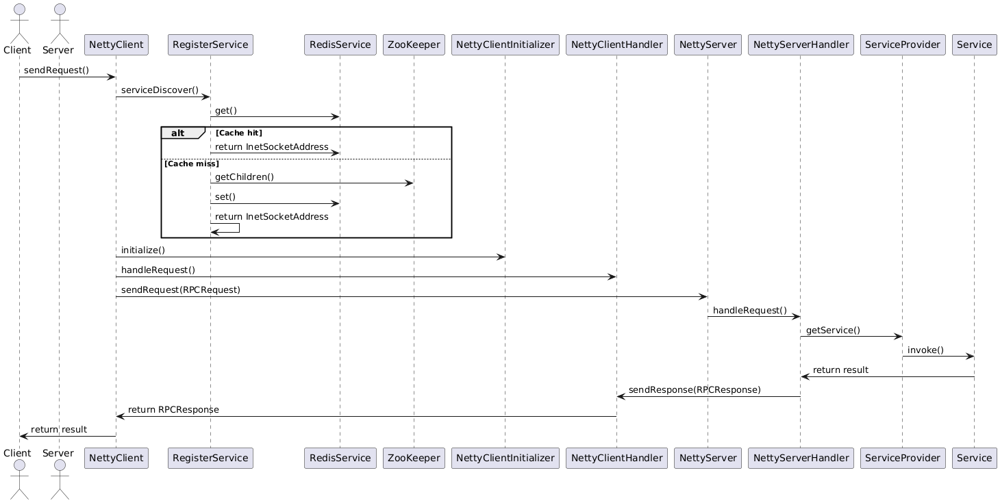

# 手写RPC
## 基本介绍
这个项目是一个基于Netty的RPC框架，旨在模拟远程过程调用（RPC）机制。该框架允许客户端调用远程服务器上的方法，就像调用本地方法一样。整个项目包括客户端、服务器、注册服务和序列化组件等部分。

主要优点：
- 异步和高性能: 基于Netty实现，具有高性能和低延迟的特性。
- 动态代理: 使用动态代理实现，使得服务加入及使用的简单化。
- 服务注册与发现: 基于Redis和ZooKeeper实现，具有高可用性和一致性。
- 灵活的序列化机制: 支持Kryo序列化，可以根据通过实现接口来定制序列化机制。

## 项目架构
整体架构图

## 各子模块介绍
说明该模块提供功能及设计原理。

### 注册中心/缓存层
通过zookeeper在根目录下添加对应的服务信息来完成服务发现，使得能够获取需要的服务对应的服务器信息。因为CPA定理的限制，往往需要在一致性和可用性之间做出选择，zookeeper选择的是保证了强一致性，这就存在一定的可用性问题，所以使用redis进行缓存，减少对注册中心的直接访问，

保证数据一致性采用旁路缓存策略，因为服务变动一般不会很频繁，所以使用zookeeper监听器调用方法来同步删除的方式。为了防止缓存删除失败发生，先设置其过期时间，此处可以修改为消息队列异步删除、重试机制来优化。

**服务注册与发现过程图**：
1. 服务启动时，ServiceProvider通过RegisterService将服务注册到ZooKeeper，并在Redis中缓存服务地址。
2. 客户端请求服务时，RegisterService首先查询Redis缓存，如果未命中则查询ZooKeeper，返回服务地址。

### 消息序列化
通过实现`Serializer`接口来实现具体的序列化/反序列化功能，将其编号并手动注册。这样就能识别序列化器的类型并正确使用。

`Encoder`及`Decoder`为组织消息格式的工具，分离了配置区域与具体的消息逻辑。我们设计的消息格式为：

| 消息类型 | 序列化器类型 | 消息体长度 | 消息体 |
| ---- | ---- | ---- | ---- | 
| 2 | 2 | 4 | length |

- 消息类型：识别源类型，方便反序列化
- 序列化器类型：便于得到相应的序列化器进行序列化/反序列化操作

他们会按照这样的格式选择正确的读取顺序及逻辑，其中具体的消息体处理即使用我们实现的序列化器。

这里我们实例使用Kryo实现，它在Java语言中有着使用方便、速度快、生成结果空间占用小的优点。

**编码与解码过程图**：

在网络传输过程中，RPCRequest和RPCResponse需要进行序列化和反序列化。

- Encoder使用KryoSerializer将对象序列化为字节数组，并写入Netty的ByteBuf。
- Decoder从ByteBuf中读取字节数组，并使用KryoSerializer进行反序列化，恢复为对象。

### netty通信
以Client为例，组成为：
- NettyClient：搭建netty通信基本框架，实现诸如建立连接、收发消息等基本功能。
- NettyClientInitializer：添加消息出入时的相关处理器，如`Decoder`,`Encoder`,`Handler`等，其实质为实现`InBoundHandler`及`OutBoundHandler`，以链表先后为基准,输入时为正序使用`InBoundHandler`，输出时为逆序使用`OutBoundHandler`。
- NettyClientHandler：具体的处理逻辑，此处为将解码后的应答信息获取在对应`Channel`。

对于两边的Handler顺序设置，均为输出前进行Encode、输入前进行Decode与具体处理逻辑。

Server端与Client基本逻辑相同。`NettyServerHandler`作用为按照请求内容取出对应的服务，利用反射得到执行结果并返回。

**客户端发送请求图**：
1. 客户端调用NettyClient的sendRequest方法，创建RPCRequest对象。
2. NettyClient通过RegisterService进行服务发现，获取服务地址。
3. NettyClient使用Netty建立到服务器的连接，并发送RPCRequest。
4. 服务器接收到请求，处理后返回RPCResponse。

**服务端接收请求图**：
1. NettyServer启动并监听指定端口，接收客户端的连接。
2. NettyServerHandler处理收到的RPCRequest，根据请求的信息调用本地服务实例的方法。
3. 调用完成后，生成RPCResponse并返回给客户端。

### 启动类
通过封装和反射，启动类只需要进行少量的配置即可启动：
- Server：添加服务地址及要提供的服务、启动服务端。
- Client：启动客户端、使用反射直接调用对应服务方法。

`ServiceProvider`存储对应的服务便于实际处理使用并将其注册到注册中心使得Client能够正确建立连接。

`RPCProxy`实际代理方法为发送我们设定的通信信息、进行通信过程。

## 整体流程

本节将总结Netty RPC框架的整体流程，包括服务注册、客户端请求、消息序列化与反序列化以及Netty通信等部分。各个子模块通过协同工作，完成高效的远程方法调用。

大致过程为：
1. **服务注册**：服务端启动时，`ServiceProvider`通过`RegisterService`将服务注册到ZooKeeper，并将服务地址缓存到Redis。
2. **服务发现**：客户端请求服务时，首先通过`RegisterService`查询Redis缓存，如果未命中则查询ZooKeeper获取服务地址。
3. **发送请求**：客户端通过`RPCProxy`生成服务接口的代理对象，代理对象调用远程方法时，会生成`RPCRequest`对象，并通过`NettyClient`发送请求。
4. **消息序列化**：`NettyClient`使用`Encoder`将`RPCRequest`序列化为字节数组，并通过Netty发送到服务端。
5. **请求处理**：服务端接收到请求后，通过`Decoder`反序列化为`RPCRequest`对象，并使用反射调用相应的服务方法，生成`RPCResponse`对象。
6. **消息反序列化**：`NettyServer`使用`Encoder`将`RPCResponse`序列化为字节数组，并通过Netty发送回客户端。
7. **返回结果**：客户端接收到响应后，通过`Decoder`反序列化为`RPCResponse`对象，并将结果返回给调用者。

即为此图对应内容
